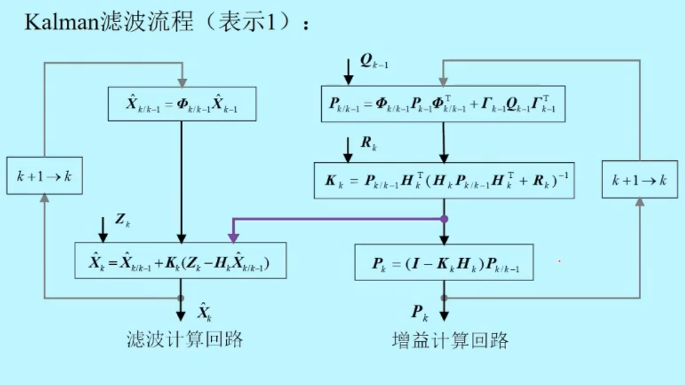
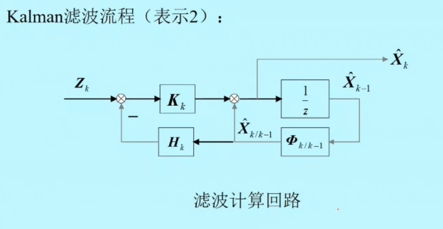
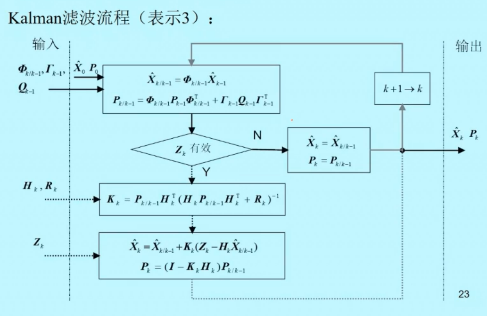
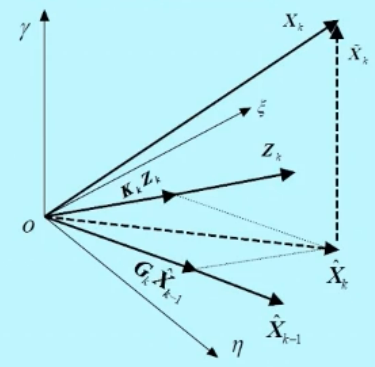

- 划分方式:左边一阶矩,右边二阶矩
- 增益回路可以不管滤波回路不断计算,如果左边的$Z_k$出现野值,对右边没有影响

---

$$
\begin{aligned}
  & \hat{X}_{k/k-1} = \Phi_{k/k-1} \hat{X}_{k-1} \\
  & \hat{X} = \hat{X}_{k/k-1} + K_k(Z_k - H_k \hat{X}_{k/k-1})
\end{aligned}
$$

- $z^{-1}$ 表示 $k-1$到$k$的离散表示
- 这是一个线性系统,所有KF是一个线性的估计器
- 以系统输出为输入,
- KF还是一个无偏估计
- 是一个线性的无偏估计,而且还是最小方差估计,(最小线性无偏估计)

---

- 适合编程的时候用
- 区别于传统滤波器的是:传统滤波器估计的是信号本身,这个信号不是随机信号,是确定性信号,好比只有一阶矩的功能,它的方差等于0.KF既要输出一阶矩也要输出二阶矩,
- 一阶矩二阶矩能代表随机信号的全部,那这个信号一定是正态分布.
- 可以推测设计滤波器一般会让高频信号作为预测(回路),低频的作为修正(估计回路).
- 量测的频率会比运动更新的频率慢一些

---

特性:
(1) 状态估计是测量的线性组合

$$
\begin{aligned}
  \hat{X}_k &= \hat{X}_{k/k-1} + K_k(Z_k - H_k \hat{X}_{k/k-1}) \\
  &= (I - K_k H_k) \hat{X}_{k/k-1} + K_k Z_k = G_k \hat{X}_{k-1} + K_k Z_k \\
  &= G_k(G_{k-1} \hat{X}_{k-2} + K_{k-1} Z_{k-1}) + K_k Z_k \\ 
  &= G_k G_{k-1} \hat{X}_{k-2} + G_k K_{k-1} Z_{k-1} + K_k Z_k \\
  &= G_k G_{k-1}  G_{k-2} \hat{X}_{k-3} + G_k G_{k-1} K_{k-2} Z_{k-2} + G_k K_{k-1} Z_{k-1} + K_k Z_k \\
  &= ... \\
  &= (\prod_{k-1}^k G_i) \hat{X}_0 + \sum_{k=1}^k(\prod_{j=i+1}^k G_j)K_i Z_i
\end{aligned}
$$

其中,$G_k = I - K_k H_k$

- 加权形式

(2)正交投影性质

(3) 新序列$\{\widetilde{Z}_{1/0},\widetilde{Z}_{2/1}, ...,\widetilde{Z}_{k/k-1}\}$为零均值噪声序列
$$
\begin{aligned}
  & E[\widetilde{Z}_{k/k-1}] = 0\\
  & E[\widetilde{Z}_{k/k-1} \widetilde{Z}_{j/j-1}^T] = (H_k P_{k/k-1}^T H_k^T + R_k) \delta_{kj}
\end{aligned}
$$

<!-- $$
\begin{cases}
   n/2       & \quad \text{if } n \text{ is even}\\
   -(n+1)/2  & \quad \text{if } n \text{ is odd}
\end{cases}
$$ -->